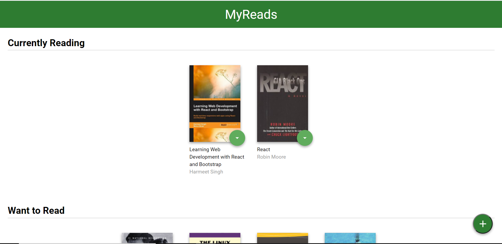

# MyReads
In the MyReads project, I have create a bookshelf app that allows one to select and categorize books they have read, are currently reading, or want to read. The project emphasizes using React to build the application and provides an API server and client library that you will use to persist information as you interact with the application.

#### Live on: https://gowthamaraj-myreads.netlify.app/

## Available Scripts

In the project directory, you can run:

### `npm start`

Runs the app in the development mode.<br />
Open [http://localhost:3000](http://localhost:3000) to view it in the browser.

The page will reload if you make edits.<br />
You will also see any lint errors in the console.

### `npm run build`

Builds the app for production to the `build` folder.<br />
It correctly bundles React in production mode and optimizes the build for the best performance.

The build is minified and the filenames include the hashes.<br />
Your app is ready to be deployed!

See the section about [deployment](https://facebook.github.io/create-react-app/docs/deployment) for more information.

## Backend Server

To simplify the development process, I used the Udacity API. The source file [`BooksAPI.js`](src/BooksAPI.js) contains the methods needed to perform necessary operations on the backend:

* [`getAll`](#getall)
* [`update`](#update)
* [`search`](#search)

### `getAll`

Method Signature:

```js
getAll()
```

* Returns a Promise which resolves to a JSON object containing a collection of book objects.
* This collection represents the books currently in the bookshelves in your app.

### `update`

Method Signature:

```js
update(book, shelf)
```

* book: `<Object>` containing at minimum an `id` attribute
* shelf: `<String>` contains one of ["wantToRead", "currentlyReading", "read"]  
* Returns a Promise which resolves to a JSON object containing the response data of the POST request

### `search`

Method Signature:

```js
search(query)
```

* query: `<String>`
* Returns a Promise which resolves to a JSON object containing a collection of a maximum of 20 book objects.
* These books do not know which shelf they are on. They are raw results only. You'll need to make sure that books have the correct state while on the search page.

## ScreenShots

This project was bootstrapped with [Create React App](https://github.com/facebook/create-react-app).

